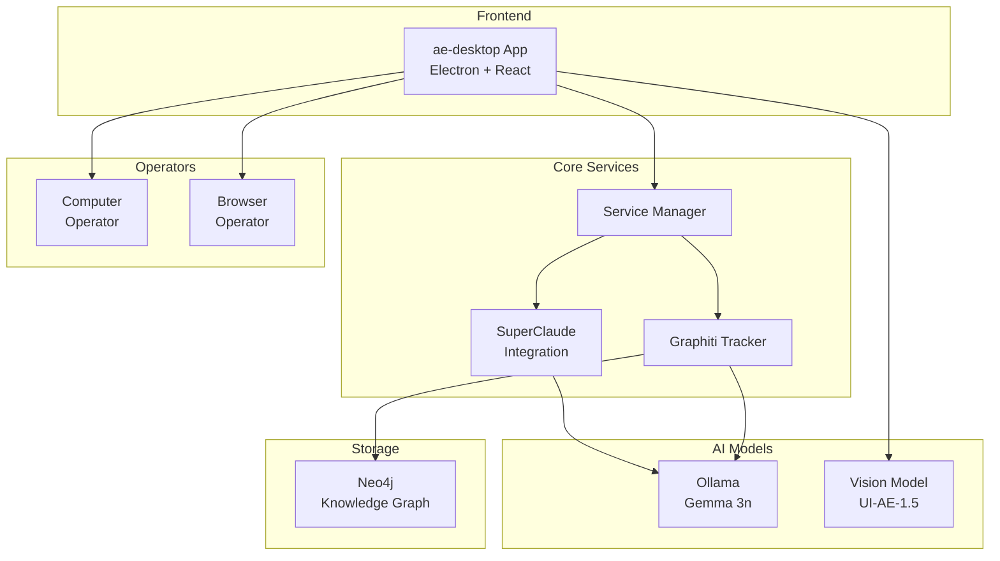

# 
```
     ███████╗ ███████╗    ██████╗  ███████╗██╗  ██╗████████╗██████╗ 
    ██╔═══██╗██╔════╝    ██╔══██╗██╔════╝██║ ██╔╝╚══██╔══╝██╔══██╗
    ████████║█████╗█████╗██║  ██║███████╗█████╔╝    ██║   ██████╔╝
    ██╔═══██║██╔══╝╚════╝██║  ██║╚════██║██╔═██╗    ██║   ██╔═══╝ 
    ██║   ██║███████╗    ██████╔╝███████║██║  ██╗   ██║   ██║     
    ╚═╝   ╚═╝╚══════╝    ╚═════╝ ╚══════╝╚═╝  ╚═╝   ╚═╝   ╚═╝     
                                                    ┌─────────────────┐
                                                    │ aegnt-desktop   │
                                                    └─────────────────┘
```

<div align="center">

[](LICENSE)
[](https://nodejs.org)
[](https://pnpm.io)
[](https://www.electronjs.org/)
[](https://www.typescriptlang.org/)

**AI-Enhanced Desktop Aegnt with Knowledge Graph Tracking and SuperClaude Integration**

[Features](#-features) • [Quick Start](#-quick-start) • [Architecture](#-architecture) • [Development](#-development) • [Contributing](#-contributing)

</div>

---

## 🚀 Features

<table>
<tr>
<td width="50%">

### 🎯 **Natural Language Control**
Control your computer using conversational commands. Just tell ae-desktop what you want to do, and it will execute the actions for you.

</td>
<td width="50%">

### 🧠 **Knowledge Graph Tracking**
Every action is tracked using Graphiti, building a temporal knowledge graph of your interactions and system state.

</td>
</tr>
<tr>
<td width="50%">

### 🤖 **SuperClaude Integration**
Enhanced with SuperClaude framework for advanced command processing, personas, and intelligent task orchestration.

</td>
<td width="50%">

### 🔓 **Free & Local Models**
Runs on free models like Gemma 3n via Ollama. No expensive API keys required - everything runs locally.

</td>
</tr>
</table>

## 📦 Quick Start

### Prerequisites

- **Node.js** >= 20.x
- **pnpm** 9.10.0 (required)
- **Docker** (for Neo4j and services)
- **macOS/Windows/Linux** with appropriate permissions

### Installation

```bash
# Clone the repository
git clone https://github.com/aegntic/ae-desktop.git
cd ae-desktop

# Install dependencies
pnpm install

# Start the desktop app
pnpm run dev:ae-desktop
```

The first run will automatically:
- 🐳 Set up Docker containers for Neo4j
- 🤖 Install Ollama and pull required models
- 🧠 Initialize Graphiti knowledge graph
- ⚡ Configure SuperClaude framework

## 🏗️ Architecture



### Key Components

<details>
<summary><b>🖥️ Desktop Application</b></summary>

- **Electron-based** desktop app with React frontend
- **Multi-platform** support (macOS, Windows, Linux)
- **Screen capture** and computer control capabilities
- **Natural language** interface for user commands

</details>

<details>
<summary><b>🧠 AI Integration</b></summary>

- **Vision-Language Model**: UI-AE-1.5 compatible models for understanding screenshots
- **Local LLM**: Gemma 3n via Ollama for natural language processing
- **SuperClaude Framework**: Advanced command processing with personas and workflows
- **Model-agnostic**: Adapts to different model capabilities automatically

</details>

<details>
<summary><b>📊 Knowledge Graph</b></summary>

- **Graphiti**: Temporal knowledge graph for tracking all actions
- **Neo4j**: Graph database for persistent storage
- **Automatic tracking**: Every action is recorded with context
- **Relationship mapping**: Builds understanding of system interactions

</details>

<details>
<summary><b>🔧 Operators</b></summary>

- **Computer Operator**: Controls desktop applications via NutJS
- **Browser Operator**: Automates web browsers
- **Action Parser**: Converts natural language to executable actions
- **Error handling**: Graceful recovery and user feedback

</details>

## 💻 Development

### Project Structure

```
ae-desktop/
├── apps/
│   └── ae-desktop/          # Main Electron application
├── packages/
│   ├── graphiti-tracker/    # Knowledge graph integration
│   ├── aegnt-infra/         # MCP servers and tools
│   ├── operators/           # Computer/browser control
│   └── shared/              # Common utilities
└── scripts/                 # Build and setup scripts
```

### Commands

```bash
# Development
pnpm dev                     # Start in development mode
pnpm dev:w                   # Start with watch mode
pnpm debug                   # Start with debugging

# Testing
pnpm test                    # Run unit tests
pnpm test:e2e               # Run end-to-end tests
pnpm coverage               # Generate coverage report

# Building
pnpm build                   # Build for production
pnpm package                # Package Electron app
pnpm publish:mac-arm64      # Publish for Mac M1/M2
pnpm publish:win32          # Publish for Windows
```

### Environment Setup

Create a `.env` file in the root:

```env
# Ollama Configuration
OLLAMA_BASE_URL=http://localhost:11434
OLLAMA_LLM_MODEL=gemma3n:e2b
OLLAMA_EMBEDDING_MODEL=nomic-embed-text

# Neo4j Configuration
NEO4J_URI=bolt://localhost:7687
NEO4J_USER=neo4j
NEO4J_PASSWORD=ae-desktop-neo4j

# Vision Model (UI-AE compatible)
VISION_MODEL_BASE_URL=your-model-endpoint
VISION_MODEL_API_KEY=your-api-key
VISION_MODEL_NAME=UI-AE-1.5
```

## 🤝 Contributing

We welcome contributions! Please see our [Contributing Guide](CONTRIBUTING.md) for details.

### Development Workflow

1. Fork the repository
2. Create a feature branch (`git checkout -b feature/amazing-feature`)
3. Commit your changes (`git commit -m 'Add amazing feature'`)
4. Push to the branch (`git push origin feature/amazing-feature`)
5. Open a Pull Request

### Code Style

- **TypeScript** for all new code
- **ESLint** + **Prettier** for formatting
- **Conventional Commits** for commit messages
- **Test Coverage** required for new features

## 📄 License

This project is licensed under the Apache License 2.0 - see the [LICENSE](LICENSE) file for details.

## 🙏 Acknowledgments

- Built on [UI-AE](https://github.com/showlab/UI-AE) vision-language models
- Powered by [Graphiti](https://github.com/getzep/graphiti) for knowledge graphs
- Enhanced with [SuperClaude](https://github.com/aegntic/souprcld) framework
- Uses [Ollama](https://ollama.ai) for local model inference

---

<div align="center">

**Built with ❤️ by [aegntic](https://github.com/aegntic)**

[Report Bug](https://github.com/aegntic/ae-desktop/issues) • [Request Feature](https://github.com/aegntic/ae-desktop/issues)

</div>